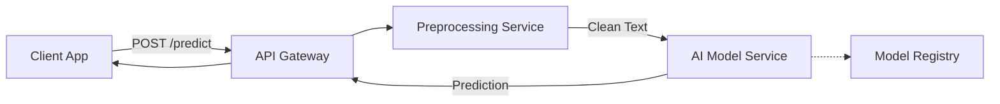

# Section 1: Problem Statement & Requirements Analysis

## The Challenge
A large enterprise receives thousands of customer support emails daily. Currently, human agents manually read and route these tickets to departments like "Billing," "Technical Support," or "Sales." This causes delays and burnout.

**Goal:** Build an automated Ticket Triage System that classifies incoming tickets into predefined categories with >85% accuracy.

## Requirements
* **Input:** Raw text (email subject and body).
* **Output:** One category label (e.g., `billing`, `technical`, `general`).
* **Latency:** < 200ms per prediction.
* **Throughput:** Handle 50 tickets/second.

---

# Section 2: System Overview (High-Level Architecture)

The system follows a standard real-time inference architecture.

## Component Breakdown

**API Gateway:** Entry point for requests.

**Preprocessing:** Cleans text (removes HTML, standardizes case).

**Model Service:** Runs the actual inference.

**Model Registry:** Stores versioned models (e.g., MLflow).
